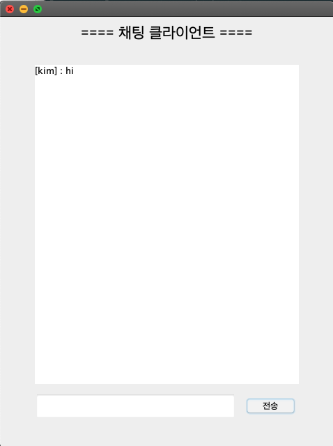

# 자바 채팅 프로그램

소켓 개념과 자바를 통해 소켓 프로그래밍을 경험하기 위해서 만든 사이드 프로젝트이다.

Swing에 능숙하지 않아 View단의 여러 이슈가 있지만, 통신은 문제 없다.


### 자바 소켓과 Swing을 이용한 채팅 프로그램  

* 자바 소켓 프로그래밍
* 자바 GUI (Swing)

  

### 구조  

<center>  </center>


  

### Preview

> Server

<center></center>

<center></center>

  

> Client

<center></center>

<center></center>


> 채팅

<center></center>


  

##  Install

```bash
// 서버 실행
git clone https://github.com/binghe819/Socket_Chatting.git
cd Socket_Chatting/Server
java -jar Server.jar

// 클라이언트 실행
cd Socket_Chatting/Client
java -jar Client.jar
```


  

## Example

> 로컬 프로세스간의 통신 방법

* 서버
  * 사용하지 않는 포트번호를 통해 서버 프로세스 작동
  * 예) 7777
* 클라이언트
  * IP : 127.0.0.1 (로컬)
  * PORT : 7777
  * NAME : 원하는 이름


